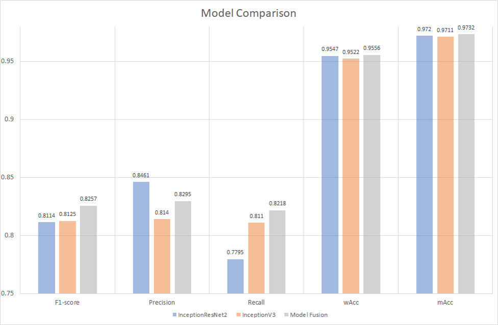

# 基于Pytorch的多标签分类


## requirements
* Python3.6
* pytorch0.4.0-gpu(注：不支持pytorch1.1.0)

## Usage

一. 训练模型：
1. 下载预训练模型inceptionresnetv2和inceptionv3:

[[pre-trained model]](https://cloud.tsinghua.edu.cn/smart-link/b64c94ee-3515-40a1-9612-af66e7a62cab/)

2. 训练inceptionresnetv2:
    ```bash
step 1: 修改该py文件main函数里的--path为存放PascalVOC数据集的路径。

step 2: 运行该文件：python train_inceptionresnetv2.py

step 3: 测试该程序训练结果： python train_inceptionresnetv2.py --stage 2
    ```

3. 训练inceptionv3:
    ```bash
step 1: 修改该py文件main函数里的--path为存放PascalVOC数据集的路径。

step 2: 运行该文件：python train_inceptionv3.py

step 3: 测试该程序训练结果： python train_inceptionv3.py --stage 2
    ```

二.测试模型：
1. 获取训练好的模型：

    ```bash
见步骤一，或者从下面的链接中下载我们训练好的模型：

[[Our best model]](https://cloud.tsinghua.edu.cn/smart-link/b64c94ee-3515-40a1-9612-af66e7a62cab/)

注：该模型只能在python0.4.0环境下运行，如果在python1.1.0下运行会报错。
    ```
2. 测试模型融合结果：

执行命令： python ModelFusion.py
    
